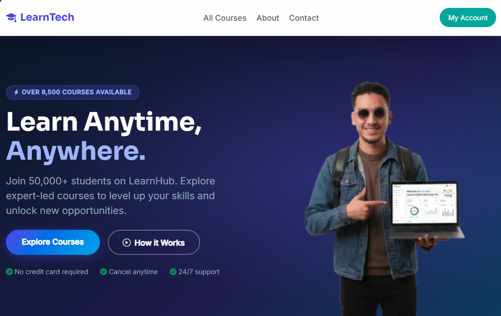

# LearnTech-v2

```markdown

```

A small online learning platform (backend: Laravel, frontend: Vite/React).

Brief: sample LMS project with courses, chapters, lessons, users, enrollments and reviews. Seeders provide example users and courses (with chapters, lessons, requirements and outcomes).

**Quick Setup**

Prerequisites
- PHP 8.2+ and Composer
- MySQL (or compatible DB)
- Node.js and npm

Backend (Laravel)

1. Copy environment file and set DB credentials:

```bash
cd backend
cp .env.example .env
# Edit .env and set DB_* values
```

2. Install dependencies and run migrations + seeders:

```bash
composer install
php artisan key:generate
php artisan migrate
php artisan db:seed
```

3. Serve the backend (dev):

```bash
php artisan serve
```

Frontend

```bash
cd frontend
npm install
npm run dev
# or build for production
npm run build
```

Seeding notes
- The `DatabaseSeeder` calls `AdminUserSeeder`, `UserSeeder`, and `CourseSeeder`.
- `CourseSeeder` creates sample categories, levels, languages, courses, chapters, lessons, requirements and outcomes.


Tips
- To reset seeded data during development you can rollback migrations then re-run them:

```bash
php artisan migrate:refresh --seed
```
